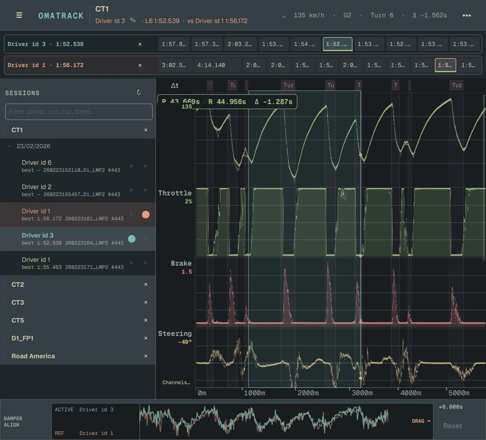
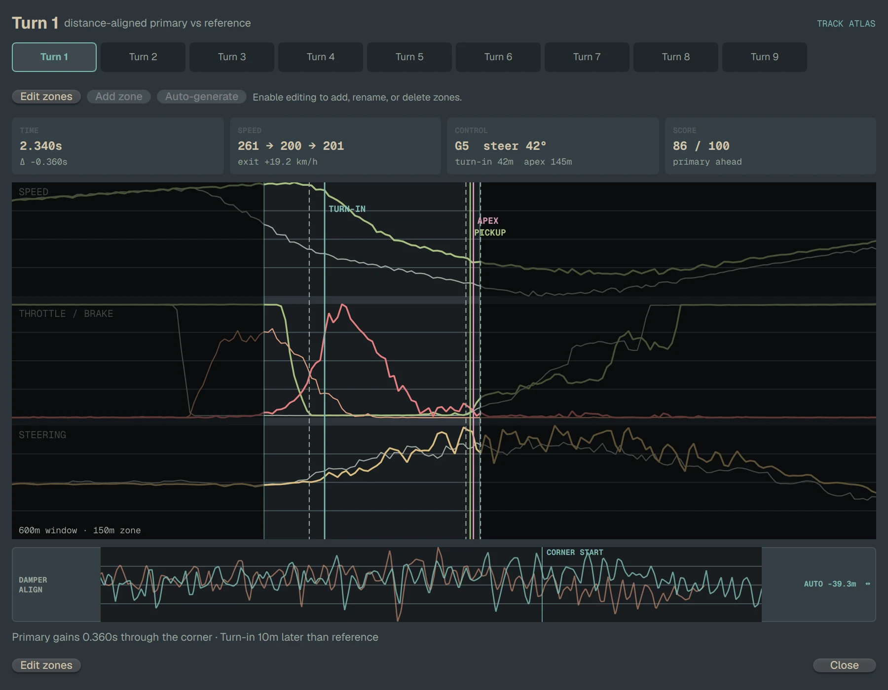
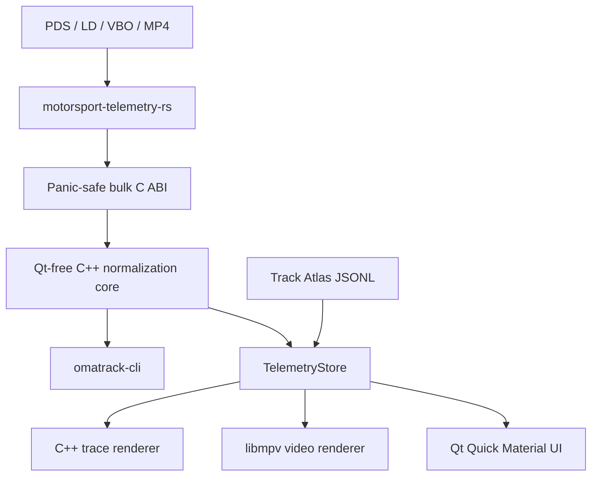

<div align="center">
  
  <h1>Omatrack</h1>
  <p>Native, cross-format motorsport telemetry analysis.</p>

  [](https://github.com/tobi/omatrack/actions/workflows/ci.yml)
  [](LICENSE)
</div>

Omatrack is a Qt 6 workstation for drivers and engineers who need one analysis workflow across heterogeneous logger formats. It normalizes every source into the same 50 Hz lap model, so traces, delta, cursor readouts, corner analysis, and synchronized onboard video use one analytical truth.

Omatrack is under active development. Linux is the primary desktop target;
Linux, macOS, and Windows are built and tested in CI.

## Screenshots

### Distance-aligned lap comparison



Shared cursor readouts, proportional lap strips, range selection, delta, and
manual damper alignment all use the same normalized lap model.

### Corner analysis



Corner metrics and trace excerpts keep the primary and reference laps aligned
through braking, turn-in, apex, and throttle pickup.

## Current capabilities

- Open Pi/Cosworth `.pds`, MoTeC `.ld`, Racelogic `.vbo`, and AiM `aimd` telemetry embedded in `.mp4`.
- Resolve `.ldx` files to their companion `.ld`; play ordinary MP4, MOV, MKV, AVI, M4V, and WebM video without treating it as telemetry.
- Group a library as Track → Date → Session → Laps, with lazy parsing and fastest-lap selection.
- Compare primary and reference laps through a cached track-station map that remains useful when GPS is sparse or absent.
- Overlay standard and raw channels, share a cursor, pan, zoom, select ranges, pin lanes, and manually align specialist signals.
- Derive distance-aligned cumulative delta and corner metrics from the normalized lap arrays.
- Consume Track Atlas corner ranges through an independent offline cache,
  spatially map them from the layout centerline when lap GPS is usable, and
  retain user-owned YAML overrides.
- Synchronize embedded onboard video through libmpv's OpenGL Render API.
- Follow the active Omarchy palette on Linux, with a Qt system-palette fallback elsewhere.
- Connect WebDAV servers, S3 buckets, and Google Cloud Storage buckets from
  Preferences; remote telemetry is streamed into a local ETag-aware cache,
  reused without downloads, and available offline. Onboard video plays over
  the network rather than being downloaded, or is downloaded on request for a
  flight.
- Inspect parsing, channel mapping, lap detection, and unification through `omatrack-cli`.

## Architecture



Vendor decoding stays in Rust. Cross-format racing analysis stays in the Qt-free C++ core. Session state and caching live in `TelemetryStore`; QML owns layout rather than telemetry loops. See [AGENTS.md](AGENTS.md) for the full architecture and engineering contracts.

## Requirements

- CMake 3.21+
- Ninja
- C++17 compiler
- Qt 6.5+ with Core, Gui, Quick, Quick Controls 2, QML, and Network
- libmpv development files
- libyaml development files
- Rust/Cargo 1.84+
- `pkg-config`

### Arch Linux

```sh
sudo pacman -S --needed base-devel cmake ninja pkgconf \
  qt6-base qt6-declarative mpv libyaml rust
```

### Ubuntu and other Linux distributions

Install Qt 6.5 or newer from your distribution or the Qt installer, then install the native dependencies. On Ubuntu:

```sh
sudo apt install build-essential cmake ninja-build pkg-config libmpv-dev libyaml-dev
```

### Windows

Use the **MSYS2 UCRT64** shell:

```sh
pacman -S --needed git \
  mingw-w64-ucrt-x86_64-cmake \
  mingw-w64-ucrt-x86_64-libyaml \
  mingw-w64-ucrt-x86_64-mpv \
  mingw-w64-ucrt-x86_64-ninja \
  mingw-w64-ucrt-x86_64-pkgconf \
  mingw-w64-ucrt-x86_64-qt6-base \
  mingw-w64-ucrt-x86_64-qt6-declarative \
  mingw-w64-ucrt-x86_64-rust
```

### macOS

Install the native dependencies with Homebrew, then install Qt 6.5 or newer
from Qt or Homebrew:

```sh
brew install cmake ninja pkg-config mpv libyaml rust
```

## Build and run

```sh
git clone https://github.com/tobi/omatrack.git
cd omatrack
cmake --preset release
cmake --build --preset release
./build/omatrack /path/to/telemetry-directory
```

On macOS, run `./build/Omatrack.app/Contents/MacOS/Omatrack`. On Windows, run
`./build/omatrack.exe` from the UCRT64 shell.

#### Windows release zip

`./scripts/package-windows.sh` builds the release, stages `cmake --install`,
and writes `dist/omatrack-<version>-windows-x86_64.zip`. The layout is flat:
`omatrack.exe`, `omatrack-cli.exe`, and the DLLs they load sit at the archive
root next to a `qt.conf`, while Qt plugins, QML modules, and license/doc files
live under `lib/` and stay out of the way.

On a fresh install the app defaults to the platform Documents folder (honoring
Windows OneDrive redirection) and creates `Documents/Telemetry` when it does
not exist.

Open a single supported telemetry or video file with the file picker, by dropping it on the window, or by passing it directly (`./build/omatrack /path/to/file`). The six most recently opened files are kept separately from configured telemetry directories. Configuration is stored in `$XDG_CONFIG_HOME/omatrack/omatrack.yml` on Linux, falling back to `~/.config/omatrack/omatrack.yml`.
An existing pre-rename `racecraft.yml`, legacy `QSettings` preferences, and Track Atlas cache are imported once; legacy files remain untouched as a backup.

## Headless inspection

```sh
./build/omatrack-cli parse /path/to/copied-session.pds
./build/omatrack-cli unify /path/to/copied-session.pds \
  --output /tmp/session.unified.csv
```

`unify` refuses to overwrite an existing file. Its CSV includes GPS latitude and longitude when available; treat exported files as sensitive location data. Omatrack never rewrites source telemetry or video.

## Install

```sh
cmake --install build --prefix "$HOME/.local"
```

The install target provides `omatrack`, `omatrack-cli`, platform deployment
metadata, and license notices. Tagged releases publish a Linux AppImage, a
macOS disk image, and a Windows zip from GitHub Actions. The macOS build is
ad-hoc signed but not Apple-notarized. Portable builds bundle Qt, libmpv,
libyaml, QML modules, media codecs, and their redistributable dependency
closure. Linux and Windows also statically link Omatrack's GNU C++ runtime.
Each package is rejected if a binary still refers to a build-machine library;
only operating-system and graphics-driver interfaces remain host-provided.

## Privacy and network behavior

Telemetry and video stay local. Omatrack does not upload session data. Track
Atlas connectivity is independent of telemetry parsing: when its metadata or
selected-layout geometry cache is missing or older than 24 hours, Omatrack
requests the public data from `raw.githubusercontent.com`; manual refresh
performs the same metadata request. Fresh caches are used without a startup
request. Offline starts retain cached corner geometry; without it, GPS laps do
not silently substitute distance-based corner locations.

Server connections are opt-in and configured in Preferences. WebDAV uses
authenticated `PROPFIND` discovery; `s3://` and `gs://` buckets use
ListObjectsV2 with AWS Signature Version 4 — Google Cloud Storage through its
S3-compatible XML endpoint, which means an HMAC interoperability key rather
than a service-account file. Each enabled connection streams changed telemetry
into `$XDG_CACHE_HOME/omatrack/<protocol>/` (or the platform cache
equivalent). ETag and Last-Modified metadata avoid unchanged downloads; a
previous cache is used when the server is unavailable. Omatrack never rewrites
remote files.

Onboard video is not downloaded by default. A session's video runs 5–30 GB
against telemetry's kilobytes, so the player streams it directly over HTTP
range requests — from a time-limited presigned URL for S3 and GCS, refreshed
automatically if it expires while the machine is asleep. Right-click a
recording and choose "Download for offline use" to keep one on this machine
for a flight; it downloads in the background, plays from disk afterwards, and
is given back from the same menu. Everything else the cache holds stays under
`cache: {limit: 20 GB}` in `omatrack.yml`, past which the least recently opened
files are dropped and re-fetched if they are wanted again. Recordings kept for
offline use sit outside that limit, since they are only there because you asked
for them. Preferences shows both numbers and can empty the cache.

Credentials — a WebDAV password, an S3 or GCS access key and secret — are
stored in plain text in the user's `omatrack.yml`, which the connection dialog
says plainly. They leave the machine only in a request to the server that was
configured, and, for video, inside the URL handed to the player; nothing logs
or displays such a URL.


## Test and lint

```sh
ctest --preset release
cmake --build --preset release --target lint
```

The test suite covers the Rust integration bridge, C++ normalization and comparison behavior, formatting, Rust lints, and QML invariants. Parser-crate tests live upstream in `motorsport-telemetry-rs`. CI runs the release build and tests on Linux, macOS, and Windows.

Update all upstream parser crates to the same commit and regenerate the lockfile with:

```sh
./scripts/update-motorsport-telemetry.sh \
  --smoke-file /path/to/copied-session.mp4
```

The optional smoke file is parsed only after the Rust, build, lint, and unit checks pass. Supply a branch, tag, or full commit as the final argument to pin something other than upstream `HEAD`.

## Project status and boundaries

- Session parsing is lazy, but opening a source currently decodes and retains whole channel arrays; this is not a streaming reader.
- Track Atlas corner ranges and GPS-based centerline station mapping are wired
  through the app. First-class corner complexes and full geometry rendering
  remain planned work.
- Embedded AiM telemetry time is translated to MP4 presentation time through
  the upstream edit-list offset exposed by Omatrack's C bridge.
- Separate-file persisted video associations and multi-video alignment are not implemented.
- The GUI is file-based post-session analysis today.

Issues and focused pull requests are welcome. Read [CONTRIBUTING.md](CONTRIBUTING.md) before changing parser, normalization, or rendering behavior.

## License

Omatrack is released under the [MIT License](LICENSE). See [THIRD_PARTY_NOTICES.md](THIRD_PARTY_NOTICES.md) for bundled font/parser licenses, system dependency terms, and Track Atlas data attribution.
